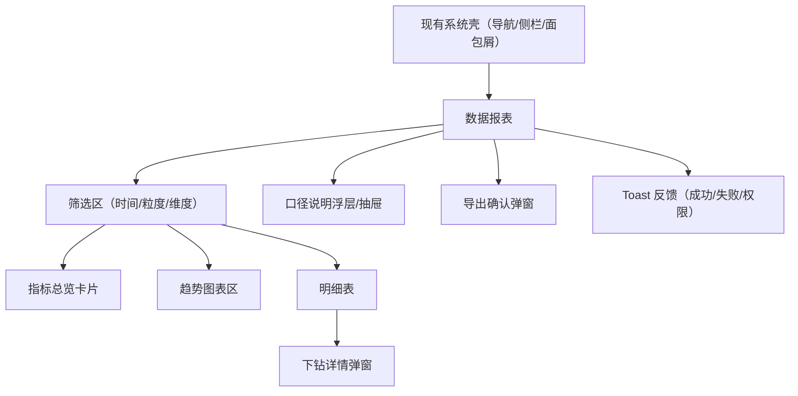

## 1. Product Overview

“数据报表”页面用于在现有系统外壳内，按时间与业务维度查看核心指标趋势与明细，并支持下钻与导出。
面向已进入系统的用户，用统一的数据口径减少“看数不一致”。

## 2. Core Features

### 2.1 Feature Module

本次需求仅新增/完善以下必要页面：

1. **数据报表**：筛选区、指标总览、趋势图/分布图、明细表、下钻详情（弹窗/浮层）、导出与反馈（toast）。

### 2.3 Page Details

| Page Name | Module Name  | Feature description                                                                                   |
| --------- | ------------ | ----------------------------------------------------------------------------------------------------- |
| 数据报表      | 外壳适配         | 复用现有系统的顶部导航/侧边栏/面包屑与全局样式；仅替换内容区，不改现有信息架构与壳组件行为。                                                       |
| 数据报表      | 筛选区（切换）      | 选择时间范围（近7/30天、自定义起止）；切换时间粒度（日/周/月，受时间范围约束）；选择统计口径维度（如：内容/账号/渠道/地区，具体枚举以现有系统为准）；点击“应用”触发刷新；点击“重置”恢复默认。 |
| 数据报表      | 指标总览（卡片）     | 展示核心指标：播放量、观看时长、完播率、互动量（点赞+评论+分享）、新增粉丝（若系统无该业务，则用现有同级指标替换）；支持展示对比值（环比/同比二选一，默认环比）与上升/下降状态。            |
| 数据报表      | 图表区（切换）      | 按所选粒度展示趋势图（折线/柱状）；支持指标切换（在图表内切换当前主指标）；hover 显示 tooltip（浮层）展示当前点多指标值；空数据时展示空态。                         |
| 数据报表      | 明细表（分页/排序）   | 表头随维度变化（例如“内容维度”显示内容名称/ID等）；支持分页；支持按关键指标排序（默认按主指标降序）；行内提供“查看详情”入口。                                    |
| 数据报表      | 下钻详情（弹窗）     | 点击表格行或“查看详情”打开详情弹窗：展示该对象在所选时间范围内的关键指标、趋势与基础信息；支持在弹窗内切换子 Tab（如：概览/趋势/明细）；关闭不丢失主页面筛选条件。                 |
| 数据报表      | 口径说明（浮层）     | 在页面右上角提供“数据口径说明”入口，打开浮层/抽屉：展示指标定义、去重规则、时区、延迟与更新频率；支持复制口径文本。                                           |
| 数据报表      | 导出           | 支持导出当前筛选条件下的“明细表”数据为 CSV；导出前做二次确认弹窗（包含导出范围与条数预估）。                                                     |
| 数据报表      | 状态与反馈（toast） | 加载中展示骨架/局部 loading；请求失败 toast 提示并提供“重试”；导出成功/失败 toast；权限不足 toast 并引导返回上一页。                            |

## 3. Core Process

### 用户流程

1. 你从现有系统导航进入“数据报表”。
2. 你在筛选区选择时间范围/粒度/维度，点击“应用”。
3. 页面刷新：指标卡片、图表与明细表同步更新。
4. 你在图表内切换主指标或查看 tooltip 浮层。
5. 你在明细表点击某行进入下钻详情弹窗，查看更细趋势/明细后关闭返回。
6. 你可打开“数据口径说明”浮层核对口径；需要离线分析时进行导出并通过 toast 获取结果反馈。

***

# 数据口径（页面级必须展示的一致性定义）

> 若现有系统已有统一口径/数据字典，以系统为准；以下为本页默认口径要求。

## A. 通用口径

* **统计时间**：按事件发生时间统计；时区固定为系统默认时区（例如 UTC+8），页面明确展示。

* **数据延迟**：默认 T+1（可配置），当选择包含“今日”时需提示“数据可能未完全入库”。

* **粒度**：

  * 日：自然日 00:00-23:59:59

  * 周：自然周（周一至周日）

  * 月：自然月

* **缺失处理**：无数据日期补 0；比率指标分母为 0 时展示为 “—”。

## B. 指标定义（建议最小集合）

* **播放量（plays）**：所选范围内“播放事件”次数之和。

* **观看时长（watch\_time\_sec）**：所选范围内观看时长累计（秒）。

* **完播率（complete\_rate）**：完播次数 / 播放次数（以事件口径）。

* **互动量（engagements）**：点赞 + 评论 + 分享 总和。

* **新增粉丝（new\_followers）**：所选范围内新增关注人数。

## C. 维度口径

* **对象维度（dimension）**：内容/账号/渠道/地区等；同一页面同一时刻仅能选择一种维度以保证表格可读性。

* **对象标识**：对象唯一 ID 必须稳定；名称可变但应提供当前名称。

***

# Mock 数据与联调要求（必须满足）

## 1) Mock 覆盖范围

* 支持时间范围：至少覆盖最近 90 天，并能按日/周/月聚合返回。

* 支持维度：至少 3 种维度枚举（用于验证表头切换）。

* 支持分页：明细表返回 total + page + pageSize + items。

* 支持异常：

  * 空数据（items 为空、趋势全 0）

  * 部分字段缺失（比率为 null）

  * 服务错误（500）与权限错误（403）

## 2) Mock 字段要求（最小契约）

* 趋势序列：\[{ date: string, plays: number, watch\_time\_sec: number, complete\_rate: number|null, engagements: number, new\_followers: number }]

* 明细表行：{ id: string, name: string, plays: number, watch\_time\_sec: number, complete\_rate: number|null, engagements: number, new\_followers: number }

* 下钻详情：{ id, name, summary: 同指标卡片, trend: 同趋势序列, meta: { created\_at?: string, tags?: string\[] } }

## 3) 数据一致性校验（Mock 也要满足）

* 指标卡片汇总值应与趋势序列求和（或同口径聚合）一致。

* 明细表合计（可选）与卡片口径一致；若不展示合计，仍需保证同筛选条件下可推导一致。

* 环比：用“上一周期（同长度时间窗）”计算并返回对比值；对比窗无数据则返回 null 并在 UI 显示“—”。

