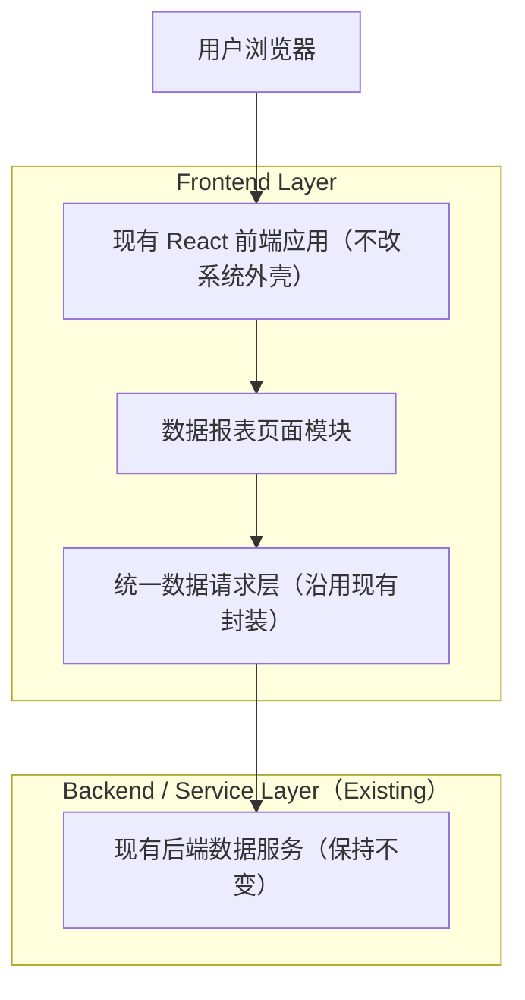

## 1.Architecture design


## 2.Technology Description
- Frontend: React@18 + TypeScript +（沿用现有路由/状态管理/组件库）
- Backend: None（本需求不新增服务；仅调用现有数据接口）
- Mock: MSW（Mock Service Worker）或现有项目的 mock 机制，用于本地/测试环境拦截接口并返回契约数据
- Chart: 沿用现有图表方案；若项目未引入，建议 ECharts 或同等成熟方案（仅在前端引入）

## 3.Route definitions
| Route | Purpose |
|-------|---------|
| /reports | 数据报表页面入口（路由命名与现有规范保持一致；如现有系统已占用该路径则按现有约定调整） |

## 4.API definitions (If it includes backend services)
> 本需求不新增后端服务；以下为“前后端契约（或 Mock 契约）”建议，用于对齐页面数据口径。

### 4.1 Core Types（TypeScript）
```ts
export type ReportGranularity = 'day' | 'week' | 'month'
export type ReportDimension = 'content' | 'account' | 'channel' | 'region'

export interface ReportFilters {
  startDate: string // YYYY-MM-DD
  endDate: string   // YYYY-MM-DD
  granularity: ReportGranularity
  dimension: ReportDimension
  compareMode: 'mom' | 'yoy' // 环比/同比（二选一）
}

export interface ReportMetrics {
  plays: number
  watch_time_sec: number
  complete_rate: number | null
  engagements: number
  new_followers: number
}

export interface ReportTrendPoint extends ReportMetrics {
  date: string // 聚合后的时间点，day:YYYY-MM-DD, week:YYYY-[W]ww, month:YYYY-MM
}

export interface ReportOverview {
  current: ReportMetrics
  compare: (ReportMetrics & { periodLabel: string }) | null
}

export interface ReportTableRow extends ReportMetrics {
  id: string
  name: string
}

export interface ReportTableResponse {
  total: number
  page: number
  pageSize: number
  items: ReportTableRow[]
}

export interface ReportDrilldownResponse {
  id: string
  name: string
  overview: ReportOverview
  trend: ReportTrendPoint[]
  meta?: Record<string, unknown>
}
```

### 4.2 Suggested Endpoints（若现有后端接口不同，以现有为准）
- GET /api/reports/overview?startDate&endDate&granularity&dimension&compareMode
- GET /api/reports/trend?startDate&endDate&granularity&dimension
- GET /api/reports/table?startDate&endDate&granularity&dimension&page&pageSize&sortKey&sortDir
- GET /api/reports/drilldown?id&startDate&endDate&granularity&compareMode

## 5.Server architecture diagram (If it includes backend services)
（无新增后端服务，本节不适用）

## 6.Data model(if applicable)
（本需求不新增数据库，本节不适用）

---

# Mock 方案落地约束（用于保证可测）
1) Mock 必须按“filters + pagination + sort”稳定返回，避免随机数导致 UI 快照/回归不稳定。
2) Mock 必须提供：空态、403、500、慢响应（>=800ms）四类场景开关。
3) Mock 返回必须满足 PRD 的一致性校验：overview 与 trend 聚合可对齐。
